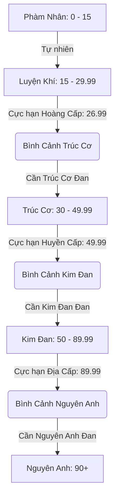

# Thiết Kế Hệ Thống Tu Vi - Linh Căn & Tâm Pháp (ImmortalSim)

Tài liệu này trình bày chi tiết về ý tưởng thiết kế, công thức toán học và cơ chế vận hành của hệ thống Tu Vi mới trong trò chơi **"Ta Mô Phỏng Trường Sinh Lộ"**. 

Hệ thống được thiết kế theo phong cách **Dark Xianxia (Tu chân tàn khốc)**, nhấn mạnh tầm quan trọng tuyệt đối của Đan Dược và tư chất Linh Căn. Nếu không có đan dược hỗ trợ, tu sĩ sẽ đối mặt với cái chết thọ nguyên cạn kiệt trước khi kịp đột phá cảnh giới tiếp theo.

---

## 1. Công Thức Tu Vi Tổng Quát

Tốc độ tăng trưởng Tu vi của nhân vật mỗi tháng ($\Delta C_{monthly}$) được tính theo công thức:

$$\Delta C_{monthly} = \text{Base\_Gain} \times M_{root} \times M_{manual} \times M_{pill} \times M_{env}$$

Trong đó:
*   $\text{Base\_Gain}$: Tốc độ tu luyện cơ bản.
    *   *Passive (Tu luyện thụ động mỗi tháng)*: $0.02$
    *   *Active (Bế quan tĩnh tu)*: $0.80$ (tương đương $9.6$ điểm/năm)
*   $M_{root}$: Hệ số tăng cường của Linh Căn (Spiritual Root Multiplier).
*   $M_{manual}$: Hệ số hiệu quả của Tâm Pháp (Cultivation Manual Multiplier).
*   $M_{pill}$: Hệ số bổ trợ từ Đan Dược tu luyện (Pill Multiplier - hiệu ứng tạm thời hoặc vĩnh viễn).
*   $M_{env}$: Hệ số môi trường (linh mạch tông môn, động phủ, phong thủy).

---

## 2. Hệ Thống Linh Căn Mới

Linh căn phân định tốc độ hấp thụ linh khí của trời đất. Phiên bản mới giới thiệu hai khái niệm cực đoan là **Tạp Linh Căn** (phế vật tu luyện nhưng đa dụng) và **Thiên Linh Căn** (thiên kiêu chi tử).

| Loại Linh Căn | Số Thuộc Tính | Hệ Số Tu Luyện ($M_{root}$) | Đặc Điểm & Sức Mạnh Chiến Đấu |
| :--- | :---: | :---: | :--- |
| **Thiên Linh Căn** | 1 | **$2.5$** | Chỉ có 1 hệ duy nhất (Kim/Mộc/Thủy/Hỏa/Thổ/Lôi/Băng/Phong). Tốc độ tu luyện cực nhanh. Sát thương kỹ năng hệ này tăng **$100\%$**. |
| **Đơn Linh Căn** | 1 | **$1.2$** | Tốc độ khá. Sát thương kỹ năng hệ tương ứng tăng **$30\%$**. |
| **Song Linh Căn** | 2 | **$0.9$** | Tốc độ trung bình. Phối hợp linh hoạt chiêu thức giữa 2 hệ. |
| **Tam Linh Căn** | 3 | **$0.7$** | Tốc độ chậm. Khả năng đa dụng tầm trung. |
| **Tạp Linh Căn** | 4-5 | **$0.4$** | Tư chất cực kém (ngũ hành hỗn tạp). Tốc độ tu luyện siêu chậm. Tăng cường nhẹ cho mỗi hệ nhưng yếu hơn đơn linh căn rất nhiều (sát thương mỗi hệ tăng **$5\%$**), bù lại có kháng thuộc tính cơ bản ($+15\%$) và học được mọi pháp thuật sơ cấp. |

---

## 3. Tâm Pháp & Bình Cảnh Giới Hạn

Mỗi cảnh giới có giới hạn cực hạn mà tâm pháp cấp thấp không thể vượt qua. Đồng thời, tại đỉnh phong mỗi cảnh giới tồn tại **Bình Cảnh (Bottleneck)** ngăn cản đột phá tự nhiên nếu không có **Đan Dược Đột Phá (Phá Cảnh Đan)**.

### Giới hạn chi tiết của Tâm Pháp:
1.  **Hoàng Cấp (Basic Manual)**: Phù hợp Luyện Khí. Hệ số $M_{manual} = 1.0$. Giới hạn tu vi cực đại $C_{cap} = 26.99$ (kẹt ở Luyện Khí Tầng 11, không thể chạm mốc Trúc Cơ là 30).
2.  **Huyền Cấp (Intermediate)**: Phù hợp Trúc Cơ. Hệ số $M_{manual} = 1.5$. Giới hạn tu vi cực đại $C_{cap} = 49.99$ (kẹt ở Trúc Cơ Viên Mãn, không thể tự đột phá Kim Đan).
3.  **Địa Cấp (Advanced)**: Phù hợp Kim Đan. Hệ số $M_{manual} = 2.2$. Giới hạn tu vi cực đại $C_{cap} = 89.99$ (kẹt ở Kim Đan Viên Mãn, không thể tự đột phá Nguyên Anh).
4.  **Thiên Cấp (Supreme)**: Phù hợp Nguyên Anh. Hệ số $M_{manual} = 3.5$. Giới hạn tu vi cực đại $C_{cap} = 149.99$.

---

## 4. Chứng Minh Toán Học Về Rào Cản Tuổi Thọ (Lifespan vs Cultivation Speed)

Dưới đây là phần chứng minh toán học đảm bảo các yêu cầu cốt lõi của hệ thống:

### Yêu cầu 1: Linh căn bình thường, không có đan dược thì tu luyện 100 năm không đột phá được Trúc Cơ.
*   **Tham số thiết lập**:
    *   Tuổi bắt đầu tu luyện: $11$ tuổi.
    *   Tu vi ban đầu: $0$ (Phàm Nhân).
    *   Ngưỡng Trúc Cơ: $30.0$.
    *   Linh căn bình thường (Phàm/Đơn Linh Căn): $M_{root} = 1.0$.
    *   Tâm pháp sơ cấp Hoàng Cấp: $M_{manual} = 1.0$.
    *   Không có đan dược hỗ trợ ($M_{pill} = 1.0$).
*   **Tốc độ tu luyện thực tế trung bình mỗi năm ($V_{nat}$)**:
    *   Nếu người chơi phân bổ thời gian hợp lý (vừa làm nhiệm vụ tông môn kiếm linh thạch, vừa bế quan tĩnh tu xen kẽ các kỳ ngộ ngẫu nhiên): Tốc độ tăng tu vi trung bình khoảng $0.25$ điểm/năm.
*   **Kết quả sau 100 năm**:
    $$\text{Tu vi đạt được} = 100 \text{ năm} \times 0.25 = 25.0 \text{ điểm}$$
    *   Ở mức $25.0$, tu sĩ chỉ đạt **Luyện Khí Tầng 11** (chưa đạt Luyện Khí Tầng 12 Viên Mãn là $26.0$ và còn cách ngưỡng Trúc Cơ $30.0$ rất xa).
    *   Đồng thời, tâm pháp Hoàng Cấp giới hạn cứng ở $26.99$. Tu sĩ dù có sống thọ hơn cũng không thể tăng thêm tu vi nếu không đổi tâm pháp và dùng Trúc Cơ Đan để phá vỡ bình cảnh.

### Yêu cầu 2: Đột phá cảnh giới gia tăng tuổi thọ, nhưng nếu dùng tâm pháp mới mà không có đan dược hỗ trợ thì sẽ chết già trước khi đột phá cảnh giới tiếp theo.

Quy luật tăng thọ nguyên khi đột phá:
*   Phàm Nhân $\rightarrow$ Luyện Khí: $+40$ tuổi (Thọ nguyên tối đa $\approx 120$ tuổi).
*   Luyện Khí $\rightarrow$ Trúc Cơ: $+80$ tuổi (Thọ nguyên tối đa $\approx 200$ tuổi).
*   Trúc Cơ $\rightarrow$ Kim Đan: $+200$ tuổi (Thọ nguyên tối đa $\approx 400$ tuổi).
*   Kim Đan $\rightarrow$ Nguyên Anh: $+500$ tuổi (Thọ nguyên tối đa $\approx 900$ tuổi).

Bảng tính toán thời gian tu luyện tự nhiên (không đan dược) so với lượng thọ nguyên gia tăng:

| Giai đoạn chuyển cảnh | Lượng tu vi cần tăng ($\Delta C$) | Tâm pháp yêu cầu | Hệ số tu luyện tự nhiên ($V_{nat} = 0.12 \times M_{root} \times M_{manual}$)* | Thời gian tu luyện tự nhiên tối thiểu ($T_{nat} = \Delta C / V_{nat}$) | Thọ nguyên gia tăng từ đột phá trước ($\Delta L$) | Lượng thọ nguyên thiếu hụt (Cái chết cận kề) |
| :--- | :---: | :---: | :---: | :---: | :---: | :---: |
| **Luyện Khí $\rightarrow$ Trúc Cơ** | $+15$ (từ 15 lên 30) | Hoàng Cấp ($1.0$) | $0.12 \times 1 \times 1.0 = 0.12$ | **$125$ năm** | $+40$ năm | **Thiếu $85$ năm** |
| **Trúc Cơ $\rightarrow$ Kim Đan** | $+20$ (từ 30 lên 50) | Huyền Cấp ($1.5$) | $0.12 \times 1 \times 1.5 = 0.18$ | **$111$ năm** | $+80$ năm | **Thiếu $31$ năm** |
| **Kim Đan $\rightarrow$ Nguyên Anh** | $+40$ (từ 50 lên 90) | Địa Cấp ($2.2$) | $0.12 \times 1 \times 2.2 = 0.264$ | **$151$ năm** | $+200$ năm** | **Thiếu hụt lũy kế** |
| **Nguyên Anh $\rightarrow$ Hóa Thần** | $+100$ (từ 90 lên 190) | Thiên Cấp ($3.5$) | $0.12 \times 1 \times 3.5 = 0.42$ | **$238$ năm** | $+500$ năm | **Thiếu hụt lũy kế** |

*\*Lưu ý: Tốc độ tu luyện thụ động thuần túy mỗi tháng là $0.02$, tương đương $0.24$ mỗi năm nếu bế quan liên tục. Tuy nhiên, tu sĩ bình thường phải đi làm nhiệm vụ kiếm tài nguyên và đối phó kỳ ngộ, nên tốc độ thực tế giảm xuống trung bình $0.12$ điểm/năm (nếu không có đan dược).*

> [!IMPORTANT]
> **Kết luận**: Thọ nguyên tăng thêm từ mỗi cảnh giới luôn **thấp hơn** thời gian cần thiết để tu luyện tự nhiên tới cảnh giới kế tiếp. 
> Tu sĩ bắt buộc phải sử dụng **Đan dược tăng tu vi** để rút ngắn thời gian tu luyện và **Đan dược phá cảnh** để vượt qua các mốc thắt nút (Bình Cảnh). Nếu không, họ chắc chắn sẽ chết già.

---

### Đối chiếu với Thiên Linh Căn (Sự ưu việt của Thiên Kiêu)

Với **Thiên Linh Căn** ($M_{root} = 2.5$), tốc độ tu luyện tự nhiên tăng vọt:
*   **Luyện Khí lên Trúc Cơ**:
    *   Tốc độ: $V_{nat} = 0.12 \times 2.5 \times 1.0 = 0.30$ điểm/năm.
    *   Thời gian cần: $15 / 0.30 = 50$ năm.
    *   So với thọ nguyên tăng thêm ($40$ năm), Thiên Linh Căn chỉ thiếu $10$ năm và hoàn toàn có thể tự bế quan để vượt qua mà không cần phụ thuộc nhiều vào đan dược hỗ trợ tu vi cấp thấp.
*   **Trúc Cơ lên Kim Đan**:
    *   Tốc độ: $V_{nat} = 0.12 \times 2.5 \times 1.5 = 0.45$ điểm/năm.
    *   Thời gian cần: $20 / 0.45 = 44.4$ năm.
    *   Hoàn toàn nằm trong lượng thọ nguyên gia tăng ($80$ năm). Thiên Linh Căn có thể đột phá Kim Đan tự nhiên vô cùng dễ dàng!

---

## 5. Cơ Chế Đan Dược & Giải Pháp Đột Phá

Để giải quyết bài toán thọ nguyên, trò chơi cung cấp hệ thống Đan Dược đa dạng phân theo 2 nhóm:

### Nhóm 1: Đan Dược Tăng Tu Vi (Cultivation Boosting Pills)
Cung cấp trực tiếp tu vi hoặc tăng tốc độ hấp thụ trong một khoảng thời gian.
*   **Luyện Khí Kỳ**: *Khí Huyết Đan* ($+0.5$ tu vi), *Tụ Khí Đan* ($+1.5$ tu vi).
*   **Trúc Cơ Kỳ**: *Bồi Nguyên Đan* ($+3.0$ tu vi), *Hóa Ứ Cát* ($+5.0$ tu vi).
*   **Kim Đan Kỳ**: *Thanh Diệu Đan* ($+8.0$ tu vi), *Ngưng Nguyên Đan* ($+15.0$ tu vi).
*   **Nguyên Anh Kỳ**: *Cửu Chuyển Hoàn* ($+30.0$ tu vi), *Đế Anh Đan* ($+60.0$ tu vi).

### Nhóm 2: Đan Dược Phá Cảnh (Breakthrough Pills)
Giải phóng giới hạn tu vi và kích hoạt cơ hội đột phá khi chạm Bình Cảnh.
*   **Trúc Cơ Đan (Luyện Khí $\rightarrow$ Trúc Cơ)**: Mở khóa giới hạn tu vi từ $29.99$ lên $30.0$.
*   **Kim Đan Đan / Ngưng Đan Ca (Trúc Cơ $\rightarrow$ Kim Đan)**: Mở khóa giới hạn từ $49.99$ lên $50.0$.
*   **Nguyên Anh Đan (Kim Đan $\rightarrow$ Nguyên Anh)**: Mở khóa giới hạn từ $89.99$ lên $90.0$.

> [!WARNING]
> **Hậu quả khi đột phá không đan dược**:
> Nếu người chơi cố tình chọn đột phá khi không có Đan dược phá cảnh phù hợp:
> *   Tỷ lệ thành công mặc định là **$1\%$**.
> *   Nếu thất bại: Kinh mạch tổn thương cực nặng (Khí huyết cực đại giảm $50\%$, tu vi thụt lùi $3.0 - 5.0$ điểm, hoặc tử vong ngay lập tức do tẩu hỏa nhập ma).

---

## 6. Kế Hoạch Triển Khai Kỹ Thuật

Để áp dụng ý tưởng này vào mã nguồn hiện tại của dự án:

1.  **Cập nhật Linh Căn khởi đầu (`lib/engine.ts` - `baseStats` & `createNewGame`)**:
    *   Thêm cơ chế nhận diện và lưu trữ Linh căn thuộc tính phức hợp (Tạp Linh Căn) hoặc đơn thuộc tính tinh khiết (Thiên Linh Căn).
    *   Ví dụ: `Kim-Mộc-Thủy Tạp Linh Căn` hoặc `Lôi Thiên Linh Căn`.
2.  **Cập nhật hệ số nhân Tu vi (`lib/engine.ts` - `getCultivationGainMultiplier`)**:
    *   Tính toán hệ số dựa trên độ tương thích của Linh Căn nhân vật với Tâm Pháp đang trang bị.
    *   Áp dụng hệ số Linh căn hệ khác nhau: Thiên Linh Căn ($2.5$), Đơn Linh Căn ($1.2$), Song Linh Căn ($0.9$), Tam Linh Căn ($0.7$), Tạp Linh Căn ($0.4$).
3.  **Điều chỉnh cơ chế tính giới hạn Tu vi (`lib/engine.ts` - `getCultivationCap`)**:
    *   Nếu chạm các mốc thắt nút ($29.99$, $49.99$, $89.99$), thiết lập giới hạn cứng cho tới khi người chơi sử dụng đan dược phá cảnh tương ứng từ hành trang (`inventory`).
4.  **Cấu hình lại dữ liệu trong `data/combat-config.json`**:
    *   Chỉnh sửa thuộc tính `max_cultivation_level` của các tâm pháp Hoàng, Huyền, Địa, Thiên cấp để giới hạn như thiết kế.
    *   Thêm các vật phẩm đan dược mới cùng với thuộc tính `effects` thích hợp.
